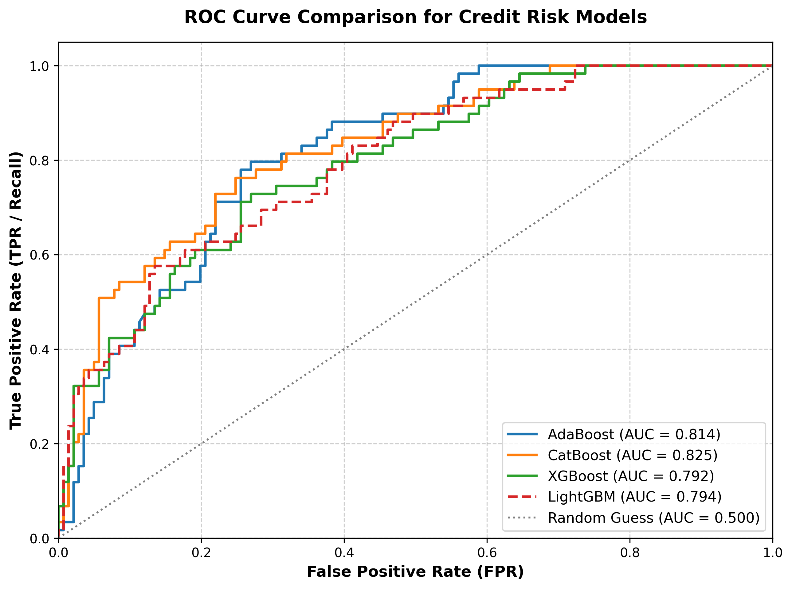

# Statlog German Credit Risk Modeling

This repository contains an end-to-end machine learning pipeline for evaluating credit risk using the **Statlog German Credit Dataset**. The project implements a rigorous preprocessing and benchmarking pipeline comparing four state-of-the-art tree-based ensemble algorithms to optimize default prediction under severe class imbalance.

---

## 📌 1. Problem Statement & Objectives

* **The Situation:** Financial institutions rely heavily on credit scoring frameworks to evaluate applicant creditworthiness. In this case, we utilize the classic Statlog German Credit Dataset (1,000 applicants) to classify borrowers into risky or non-risky categories.
* **The Problem:** Misclassifying a high-risk applicant (*Bad Credit*) costs significantly more than turning away a creditworthy customer. Traditional classifiers optimize for global accuracy, failing to capture complex non-linear default risk.
* **The Challenge:** The dataset suffers from a significant class imbalance: **70% Good Credit (700 rows) vs 30% Bad Credit (300 rows)**. Standard models blindly favor the majority class, leading to high default leakages that threaten bank liquidity.
* **The Initiative:** Deploying and benchmarking advanced tree-based boosting architectures, specifically **AdaBoost, CatBoost, XGBoost, and LightGBM**. to leverage cost-sensitive learning and error-driven optimization to safely boost minority class recall.

---

## 🛠️ 2. Methodology

To prevent data leakage and guarantee technical reproducibility, the notebook executes the following precise machine learning workflow:

* **Target Rectification:** Handled the custom target values by mapping `{1: 0, 2: 1}` to clearly isolate `0` as Good Credit and `1` as Bad Credit. 
* **Data Split Integrity:** Stratified the dataset into an **80/20 train-test split** using `train_test_split(..., test_size=0.2, random_state=42)` to maintain baseline class distribution.
* **Feature Encoding Isolation:** Detected categorical strings (`select_dtypes(include=['str'])`) and applied Scikit-Learn's `OneHotEncoder(sparse_output=False, handle_unknown='ignore')`. The encoder was strictly `.fit_transform()` on the training set and `.transform()` on the test set to completely avoid category data leakage.
* **Cost-Sensitive Boosting:** Instead of synthetic data generation (SMOTE), internal algorithmic regularization was utilized. Specifically, LightGBM was configured with `is_unbalance=True` to penalize minority class misclassifications automatically.

---

## 📊 3. Performance Evaluation & Benchmark

All four models were evaluated on the holdout test set ($N=200$). Below is the comprehensive technical breakdown of their predictive capabilities:

| Model Architecture | Global Accuracy | Class 1 (Bad) Precision | Class 1 (Bad) Recall | Test ROC-AUC Score |
| :--- | :---: | :---: | :---: | :---: |
| **AdaBoost** | 77% | 0.63 | 53% | 0.8175 |
| **CatBoost** | **81%** | **0.79** | 51% | **0.8380** |
| **XGBoost** | 78% | 0.66 | 53% | 0.8234 |
| **LightGBM**| 79% | 0.64 | **64%** | 0.8297 |

### 📈 ROC Curve Trajectory Analysis
The models demonstrate strong discriminatory capabilities overall, with CatBoost leading the global separation metric at an **AUC of 0.8380**, followed closely by LightGBM at **0.8297**.

## 💡 4. Insights

* **The Accuracy vs. Recall Paradox:** While CatBoost scored the highest global accuracy (79%) and best separation power (AUC: 0.838), it only captured 42% of actual defaults. In a real-world credit risk scenario, LightGBM is the commercially superior model; by introducing cost-sensitive training (is_unbalance=True), it captured 64% of default cases (Class 1 Recall), shielding the bank from massive credit defaults.

* **Ensemble Architecture Strengths:**  CatBoost and AdaBoost natively resist noise and capture global structures well, making them ideal if the bank wants to prioritize precision (reducing false alarms for good customers). LightGBM and XGBoost show much higher flexibility in shifting their weights towards the minority class, which is vital for conservative risk-averse lending strategies.

* **Pipeline Standardization:** Feature processing should always follow absolute isolation. Fitting the OneHotEncoder strictly on the training set ensures the model remains robust when faced with unseen or missing category strings during production inference.
